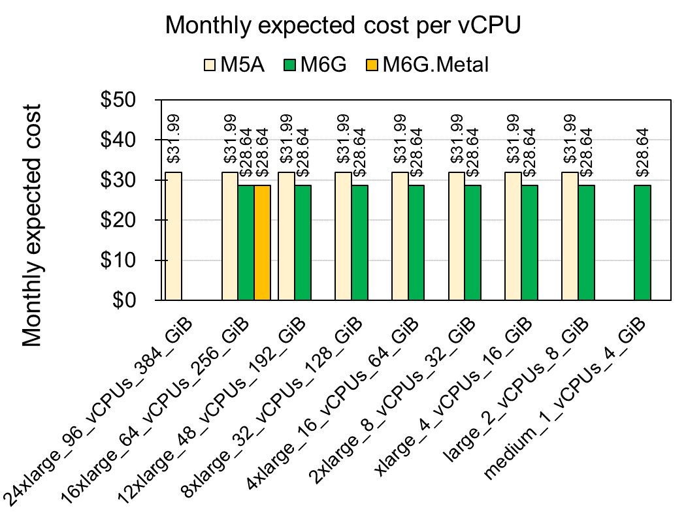

# Let's talk about cost of AWS EC2

Written by Seungsoo Kim

Last update at 4/4/2021

# 1. Too many services to choose in AWS EC2

There are 352 instance APIs by in various options of CPUs, Memories, and GPUs in AWS EC2 (https://instances.vantage.sh/). In fact, I found 15 vCPU options, 45 memory options, and 5 GPU options. The instances categorized by the purpose of use in 59 services named as A1, C3, M5, etc. The services have hierarchical tree with specific variations such as M5, M5A, M5AD, M5D, M5DN, M5N, and M5ZN. In our lab, we usually used instances in M5A services which is for general purpose (both CPU and memory).

# 2. M6G service is the most cost effective

To identify efficiency of the current M5A service, I calculated monthly cost (24 hrs x 31 days) based on their "Linux On Demand cost". To normalize the cost of services, I calculated the cost for a vCPUs and 4 GiB memory of instances. For example, for M5A service, \$31.002 for 1 vCPU and \$31.992 for 4 MiB memory. Top 20 cheap services for CPU and Memory are displayed at Fig 1 and 2, respectively.

Fig 1.

Fig 2.

I found M6G is cheaper than M5A for both CPU and memory which has \$28.644 for both 1 vCPU and 4 MiB memory. For direct comparison between M5A and M6G, I extracted instances from both services and displayed at Fig 3.

Fig 3.

As the result, every instances of M6G are >10% (\$3.35) cheaper than those of M5A service. For more details please see [Amazon webpage](https://aws.amazon.com/ec2/instance-types/m6/?nc1=h_ls). Additionally, direct comparison among the instances having 64 vCPUs and 256 MiB also shows M6G is the most cost-effective service (Fig 4).

Fig 4.

# 3. HPC vs Cloud computing

Apache Spark is the popular service to support cloud computing. I assumed that I can use the Apache Spark for work instead of HPC. Then I calculated how much I can save for the monthly expected cost. For comparison, I set the criteria as the cost of the m5a.24xlarge HPC which serves 96 vCPUs and 384 GiB memory. The monthly expected costs of instances are calculated from the multiplication of constant number for equal or over the criteria CPU and memory capacities (Fig 5 and 6).

Fig 5.

Fig 6.

As the result, CPU and Memory have different cost-effective instances such as A1 for CPU and R6G for memory. For example, if I set up 16 a1.4xlarge instances clustered with the Apache Spark system, I can use 96 vCPUs and 512 MiB memoires which is larger than the single m5a.24xlarge instance as well as 59% (\$1,250) cost reduction. See details for A1 EC2 service at AWS homepage (https://aws.amazon.com/ec2/instance-types/a1/?nc1=h_ls). Similary, I can save the monthly cost by choosing r6g.16xlarge instance for bigger memory.

# Conclusion

In this article, I compared 352 AWS EC2 instances to find the most cost-effective service. As the result, I found M6G is better than M5A service in general use (e.g., HPC) as well as A1 for CPU and R6G for memory capacity. This result is highly useful for reducing the future costs of AWS EC2.

