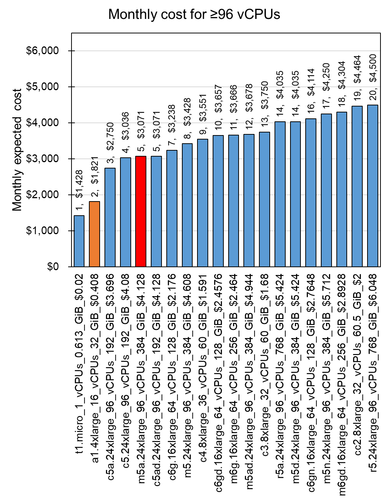

# Let's talk about what is cost-effective service in AWS EC2

Written by Seungsoo Kim

Last update at 4/4/2021

# 1. Too many services to choose in AWS EC2

There are 352 instance APIs by in various options of CPUs, Memories, and GPUs in AWS EC2 (https://instances.vantage.sh/). Those are combinations of 15 vCPU options, 45 memory options, 5 GPU options, etc. The instances categorized by the purpose of use in 59 different services named as A1, C3, M5, etc. The services have sub-services with variations such as M5, M5A, M5AD, M5D, M5DN, M5N, and M5ZN. In my case, I usually has been used instances in M5A services which are for general purpose (both CPU and memory).

# 2. M6G service is the most cost-effective for general purpose use

To evaluate cost-effectiveness of the current M5A service, I calculated monthly cost (24 hrs x 31 days) based on their "Linux On Demand cost" which is hour-based amount. To normalize the cost of services, I calculated the cost for a vCPUs and 4 GiB memory of instances, respectively. For example, M5A service has \$31.002 for 1 vCPU and \$31.992 for 4 MiB memory. The top 20 cost-effective services for CPU and Memory are displayed at **Fig 1 and 2**, respectively.

Fig 1. Monthly cost per vCPU

Fig 2. Monthly cost per 4 MiB memory

Although current M5A service ranked at 8th in CPU and 16th in Memory, I found M6G service is cheaper than M5A for both CPU and memory in use for general purpose which has \$28.644 for both 1 vCPU and 4 MiB memory. For direct comparison between M5A and M6G, I extracted all instance from the both services (**Fig 3**).

Fig 3. Monthly expected cost for 96 vCPUs

As the result, every instances of M6G are >10% (\$3.35) cheaper than those of M5A service (See details at [Amazon M6G](https://aws.amazon.com/ec2/instance-types/m6/?nc1=h_ls)). Additionally, direct comparison among the instances having 64 vCPUs and 256 MiB also shows M6G is the most cost-effective service (**Fig 4**).

Fig 4. Monthly cost of 64 vCPUs and 256 MiB memory

# 3. Cloud computing with A1 or R6G is more cost-effective than single instance of M5A

Apache Spark is the popular service to support cloud computing. I assumed that I can use the Apache Spark for work instead of HPC. Then I calculated how much I can save for the monthly expected cost. For comparison, I set the criteria as the cost of the m5a.24xlarge HPC which serves 96 vCPUs and 384 GiB memory. The monthly expected costs of instances are calculated from the multiplication of constant number for equal or over the criteria CPU and memory capacities (**Fig 5 and 6**).

Fig 5. Monthly cost for ≥96 vCPUs with multiple instances by cloud computing

Fig 6. Monthly cost for ≥384 GiB memory with multiple instances by cloud computing

As the result, CPU and Memory showed different cost-effective instances such as A1 for CPU and R6G for memory. For example, if I set up 16 a1.4xlarge instances clustered with the Apache Spark system, I can use 96 vCPUs and 512 MiB memoires which is 33% larger than the single m5a.24xlarge instance with 59% (\$1,250) cost reduction (See details at [AWS A1](https://aws.amazon.com/ec2/instance-types/a1/?nc1=h_ls)). In the same sense, I can save the monthly cost by choosing multiple instances of r6g.16xlarge as computing cluster for bigger memory.

# Conclusion

In this article, I compared 352 AWS EC2 instances to find the most cost-effective service. As the result, I found M6G is better than M5A service in general use (e.g., HPC) as well as A1 for CPU and R6G for memory capacity. This result is highly useful for reducing the future costs of AWS EC2.

